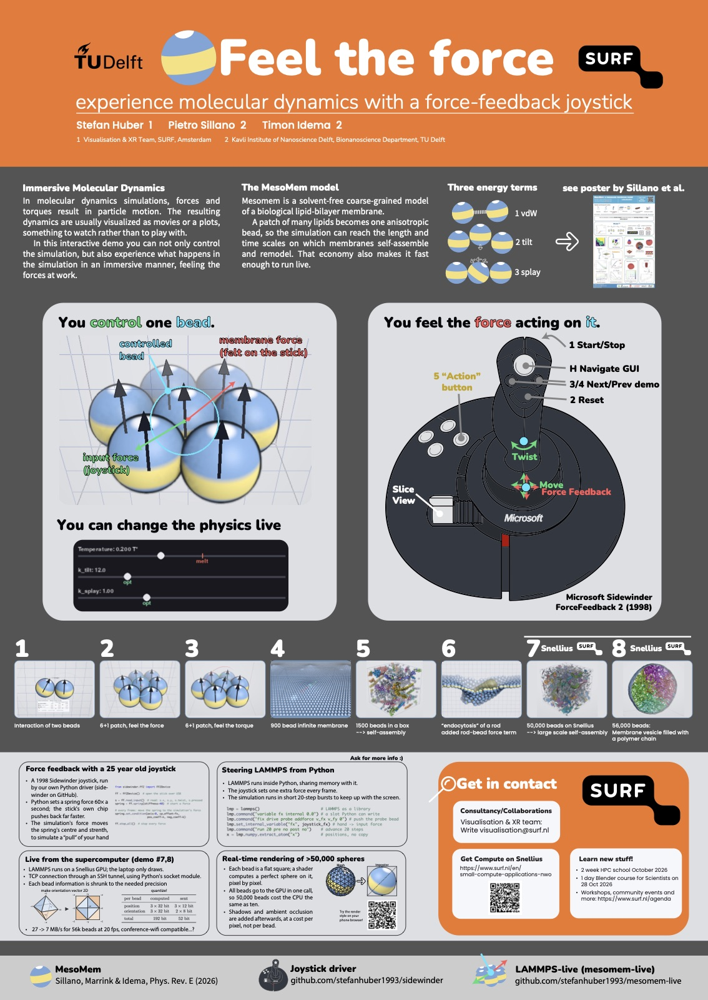

# Feel the force

Experience molecular dynamics with a force feedback joystick.

**Stefan Huber**<sup>1</sup>, **Pietro Sillano**<sup>2</sup>, **Timon Idema**<sup>2</sup>

<sup>1</sup> Visualisation & XR Team, SURF, Amsterdam<br>
<sup>2</sup> Kavli Institute of Nanoscience Delft, Department of Bionanoscience, TU Delft

In molecular dynamics simulations, forces and torques result in particle
motion. The resulting dynamics are usually visualized as movies or plots,
something to watch rather than to play with. In this interactive demo you can
not only control the simulation, but also experience what happens in it in an
immersive manner, feeling the forces at work: a live LAMMPS simulation runs under
a 60 fps game loop, you push one bead around with a 1998 joystick, and the
joystick pushes back with the force the membrane puts on that bead.


MesoMem ([Sillano, Marrink & Idema, Phys. Rev. E 2026](https://journals.aps.org/pre/abstract/10.1103/4dhv-8xd7),
[arXiv:2602.24123](https://arxiv.org/abs/2602.24123)) is a solvent-free coarse-grained model of a biological
lipid-bilayer membrane. A patch of many lipids becomes one anisotropic bead, so
the simulation can reach the length and time scales on which membranes
self-assemble and remodel. That economy also makes it fast enough to run live.
Each bead carries a director (the yellow/blue banding), and there are three
energy terms: van der Waals, tilt and splay. The app uses the authors' own C++
pair style, compiled into LAMMPS as a plugin.

Presented as a poster and live demo at NWO Biophysics 2026, next to the MesoMem
poster by Sillano et al.



## The game loop

LAMMPS runs inside Python as a library and shares its memory with it. Every
frame the joystick sets one extra force on the controlled bead, and the
simulation advances a short burst of steps.

```python
from lammps import lammps

lmp = lammps()                                       # LAMMPS as a library
lmp.file("in.membrane")                              # an ordinary input deck
lmp.command("variable fx internal 0.0")              # slots Python can write
lmp.command("variable fy internal 0.0")
lmp.command("fix drive probe addforce v_fx v_fy 0")  # push the probe bead

while running:
    fx, fy = hand_force()                            # from the stick
    lmp.set_internal_variable("fx", fx)              # not a new fix, so no re-setup
    lmp.set_internal_variable("fy", fy)
    lmp.command("run 20 pre no post no")             # advance 20 steps
    x = lmp.numpy.extract_atom("x")                  # positions, no copy
    draw(x)
```

The real version is `lammps_live/playground/modes.py` (the drive) and
`lammps_live/playground/system.py` (the stepping). The run happens in a
background thread, so the next 20 steps compute while the frame draws.

## The joystick

A Microsoft Sidewinder Force Feedback 2, run by our own Python driver,
[sidewinder](https://github.com/stefanhuber1993/sidewinder). Python sets a spring
about 60 times a second. The spring itself runs on the stick's own chip, which
pushes back much faster than that. The force from the membrane moves the
spring's centre and sets how stiff it is, so you feel a pull towards wherever the
membrane wants the bead to go.

```python
from sidewinder.ff2 import FF2Device

ff = FF2Device()
spring = ff.spring(stiffness=1)                  # limp until something pushes

while running:
    s = ff.read_input()                          # s.x, s.y, s.twist in -1..1
    set_hand_force(gain * s.x, -gain * s.y)      # into fix addforce above
    fx, fy = force_on_probe()                    # what the membrane pushes with
    k = int(1 + 126 * contact(fx, fy))           # firm on contact
    spring.set_condition(axis=0, cp_offset=int(fx), pos_coeff=k, neg_coeff=k)
    spring.set_condition(axis=1, cp_offset=int(-fy), pos_coeff=k, neg_coeff=k)
```

On top of that there is a damper and a small vibration that grows with
temperature (`lammps_live/input/joystick.py`). The buttons: trigger is
start/stop, 2 resets, 3/4 go to the previous/next scene, the hat moves around the
GUI, 5 and up are each scene's "action" buttons, twist turns the bead's
director, and the thrust lever cuts a slice through the 3D view. Mouse and
keyboard work too (`--input mouse`).

## Eight scenes

| | | |
|---|---|---|
| 1 | `mesomem_bead` | interaction of two beads |
| 2 | `mesomem_patch` | 6+1 patch, feel the force |
| 3 | `mesomem_patch_torque` | 6+1 patch, feel the torque |
| 4 | `mesomem_sheet` | 900 beads, an infinite (periodic) membrane |
| 5 | `mesomem_assembly` | 1500 beads in a box, self-assembling |
| 6 | `mesomem_rod` | "endocytosis" of a rod, with an added rod-bead force term |
| 7 | `mesomem_remote` | 50,000 beads on Snellius, large scale self-assembly |
| 8 | `mesomem_vesicle_chain` | 56,000 beads, a membrane vesicle filled with a polymer chain |

Temperature, `k_tilt`, `k_splay` and the other coefficients are sliders you can
move while it runs.

## Scenes 7 and 8 run on Snellius

These two run on a GPU on Snellius, the Dutch national supercomputer at SURF,
and the laptop only draws. Press `N` on either scene and the app asks Slurm for a
GPU, starts a server there, and connects to it over a TCP connection through an
SSH tunnel. Each bead is sent as 3 × 12 bit position and 2 × 8 bit orientation,
which is about 7 MB/s for 56k beads at 20 fps, little enough for conference wifi.
Both remote scenes share one allocation, so switching between them doesn't queue
again.

Your login, account, partition and paths go in a config file:

```bash
lammps-live --write-config       # writes ~/.config/lammps-live/config.toml
```

```toml
[remote.systems.snellius]
host = "snellius.surf.nl"
user = "your-login"
partition = "gpu_a100"
account = "your-project"
remote_dir = "~/lammps-mesomem"  # where LAMMPS lives on the cluster
env_script = "env.sh"            # sourced there before the server starts
profile = "cluster-gpu"
```

What the cluster needs: SSH access, Slurm, and a LAMMPS build with the Python
module, numpy, the MesoMem pair style and Kokkos+CUDA. The app doesn't build that
for you, but it checks for it before asking for a GPU, and `lammps-live --doctor`
prints the check command. See [docs/cluster-setup.md](docs/cluster-setup.md) and
[docs/snellius/README.md](docs/snellius/README.md).

## Rendering

The 3D scenes draw every bead as a sphere impostor: a flat square, on which a
shader computes a perfect sphere pixel by pixel. All beads go to the GPU in one
call, so 50,000 beads cost the CPU the same as ten. Shadows and ambient occlusion
are added afterwards, at a cost per pixel, not per bead.

The same renderer runs in a browser, also on a phone:
[the impostor viewer](https://stefanhuber1993.github.io/lammps-live/). The long
explanation is in [docs/impostor-book](docs/impostor-book/).

## Run it

```bash
brew install mpich hidapi git     # Linux: apt install build-essential mpich libmpich-dev libhidapi-hidraw0
python3 -m venv venv && source venv/bin/activate
pip install -e .
lammps-live --doctor              # check what this machine resolved to
lammps-live --input joystick      # or --input mouse
```

MPICH, not Open MPI, because the `lammps` wheel links against it. The MesoMem
plugin compiles itself the first time you open a 3D scene (about 10 seconds).

## More

- [docs/details.md](docs/details.md): what every scene shows, the full joystick
  mapping, the remote setup in depth, kiosk mode (`--lock`), adding a scene
- [docs/install.md](docs/install.md): other platforms and compilers, Linux udev rule
- [docs/remote-gpu.md](docs/remote-gpu.md): how the remote connection works

Contact: visualisation@surf.nl
